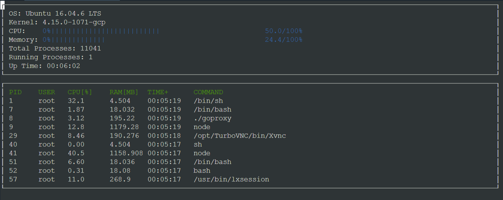

# CppND-System-Monitor

## This code allows the user to mimic the HTOP environment in a Linux terminal by manually parsing the system and processes data of the terminal.

## linux_parser.cpp
The core code that allows most of the parsing in the project.

## System.cpp
This code parses data about the system using the help of linux_parser.cpp.

## Process.cpp
This code parses data about the different processes using the help of linux_parser.cpp.

## format.cpp
Short code for formatting the time displayed in the monitor.

## Processor.cpp
Parses data about the processor.

## ncurses_display.cpp
[ncurses](https://www.gnu.org/software/ncurses/) is a library that facilitates text-based graphical output in the terminal. This project relies on ncurses for display output.

## Make
This project uses [Make](https://www.gnu.org/software/make/). The Makefile has four targets:
* `build` compiles the source code and generates an executable
* `format` applies [ClangFormat](https://clang.llvm.org/docs/ClangFormat.html) to style the source code
* `debug` compiles the source code and generates an executable, including debugging symbols
* `clean` deletes the `build/` directory, including all of the build artifacts
